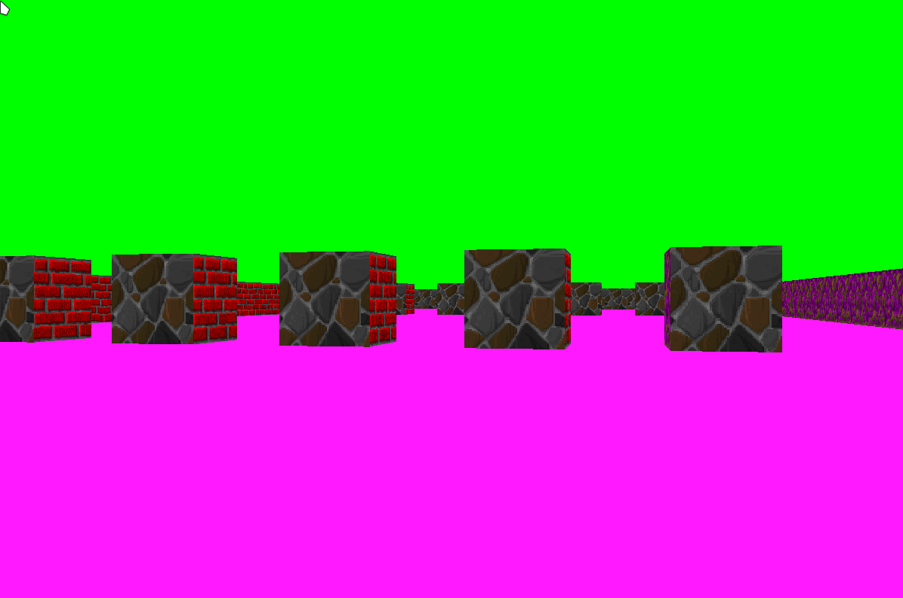

- [Introduction](#introduction)
- [Usage](#usage)
- [Commands](#commands)

## Introduction

This project is inspired by the iconic 90's game [Wolfenstein 3D](https://en.wikipedia.org/wiki/Wolfenstein_3D). Using C, we delve into [raycasting](https://en.wikipedia.org/wiki/Ray_casting##), a rendering technique that creates a three-dimensional perspective from a two-dimensional map.

  

## Usage
Clone the repository:
`
git clone https://github.com/pluis29/cub3d.git cub3d
`

Make sure you have clang and make installed.

Inside the cub3D folder, run:
`make` 

Then start the game with: `./cub3d ./assets/mandatory.cub`

In the assets folder, you'll find some maps that you can use, or you can customize them to create your own layouts.

## Commands

| Key   |    Action     |
| ----- | :-----------: |
| `W`   | move forward  |
| `S`   | move backward |
| `A`   |   move left   |
| `D`   |  move right   |
| `ESC` |   exit game   |
